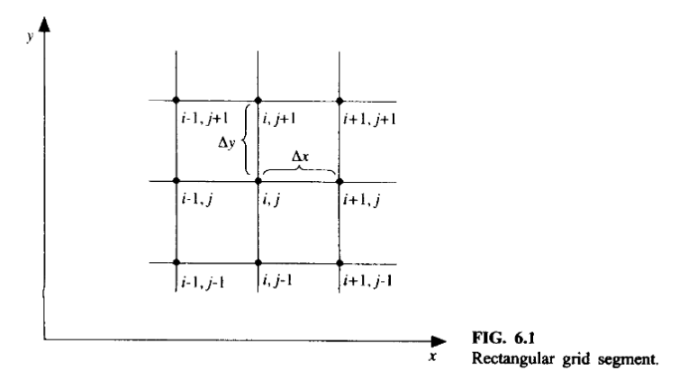
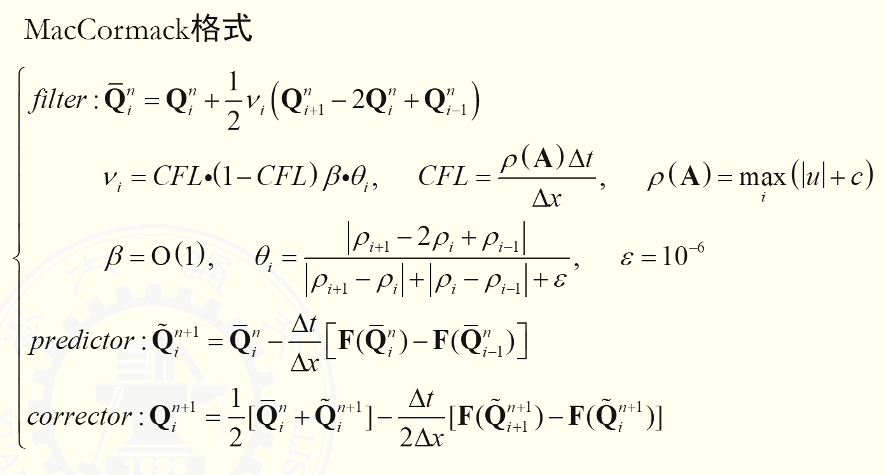

# MacCormack格式

""MacCormack方法是一种Lax-Wendroff格式的变体，但其应用更为简便。与Lax-Wendroff方法类似，MacCormack方法也是一种显式有限差分技术，在空间和时间上均具有二阶精度。该方法于1969年首次提出（参考文献43），并在随后的15年间成为求解流体流动问题最流行的显式有限差分方法。如今，MacCormack方法大多已被更复杂的方法所取代，其中部分方法将在第11章中讨论。然而，MacCormack方法非常“友好易学”：它是最易于理解和编程的方法之一。此外，对于许多流体流动应用而言，使用MacCormack方法获得的结果完全令人满意。基于这些原因，本文在此重点介绍MacCormack方法，并将其用于第三部分的部分应用实例中。对于初学者而言，这是引入计算流体力学乐趣的极佳方法。""

———— 摘自 Computational Fluid Dynamics The Basics With Applications (John,John D.Anderson, Derson An etc.)

以单个方程为例

构造思路，格式分成两步
第一步（预估步），FTBS，得到中间时刻
第二步（矫正步），中间时刻代入，FTFS，时间导数的历史用均值代替（类似于LAX但非空均，而是时均），空间导数聚焦中间时刻

像Lax格式，但又不一样，关键是引入预估步，第一步用后差可能会带来缺陷，第二步再用前差修正（考虑迎风？）

除了上述，还能反过来，得到第二种MacCormack格式的形式

**在具体编程时，可以两个都用，每一步时间步进两种方法交替迭代，尽可能消除**

注意到MacCormack格式不涉及半节点、插值、矩阵乘法，所以计算代价很好；但是由于其是中心型，格式粘性很小，以色散为主，需要引入让人工粘性格式———— **前置滤波法**

内涵为：
试想迭代过程中，由n-1时刻算出n时刻Q后，不直接进行下一步迭代，而是先给Q加一项人工粘性项(Q的二阶导)————可以看出热传导/扩散Equation.
也就是说，如果一个Q有振荡，这个二阶导数的引入把振荡消除了，得到滤波后的结果然后再进入迭代

# 总结MacCormack格式的特点

① 时空都是二阶精度（如何证明？）

② 格式粘性小,具有较好的激波分辨率,计算的激波间断过渡区较窄。但是格式具有色散效应,在激波间断上游会产生非 物理振荡。在使用时必须添加人工粘性项以抑制非物理振荡;

③ 对于一维线性波动方程,Lax-Wendroff和MacCormack格式等价,但是对于非线性的Euler方程,二者不等价;

④ MacCormack格式无需半点通量的插值计算与Jacobian矩阵的计算,使用比Lax-Wendroff简单;
但缺点是：①方程个数增加 ②

⑤ MacCormack格式涉及到中间状态物理量计算,边界条件提法不确定。